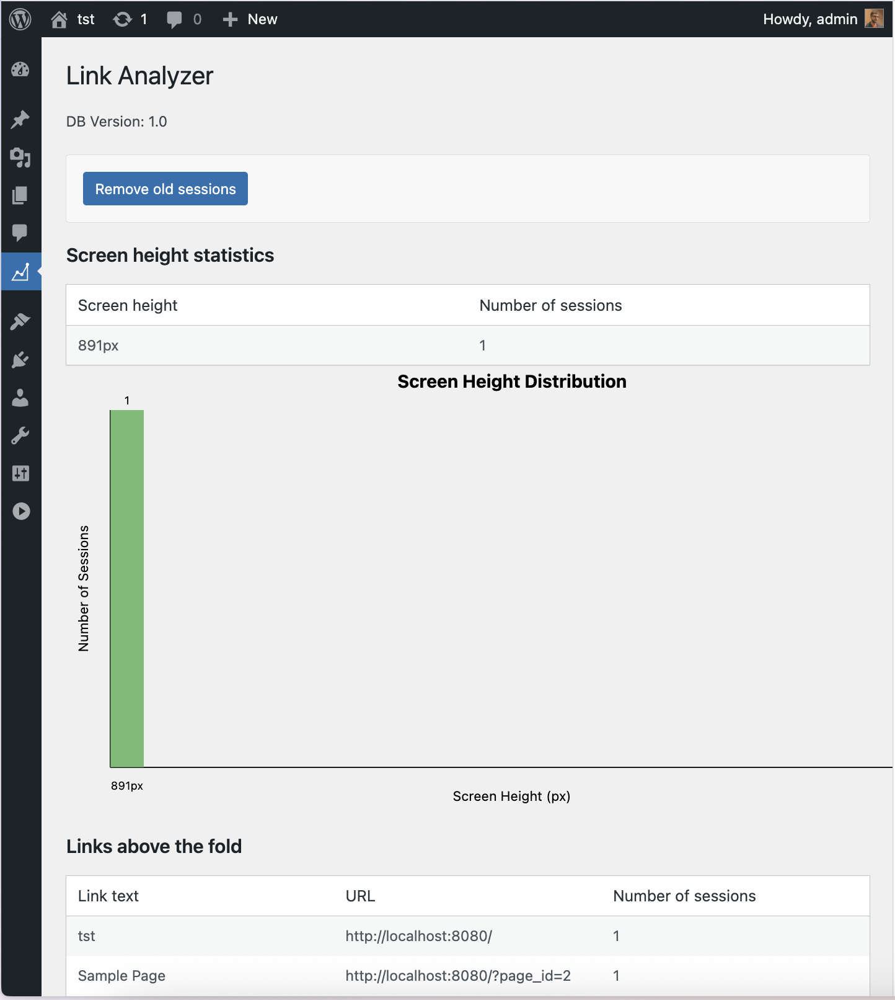

# Link Analyzer Plugin

Plugin to analyze links shown above the fold on the home page.

## Installation

You can install the plugin on your website. The plugin will create a new menu item in the WordPress admin panel.




## Starting

For testing locally:
- Run `composer install`
- Run `npm install`

For local testing, you can use the docker compose set up:

```
docker compose up
```

This will provide following HTTP access:
* http://localhost:8080 — WordPress instance where you can activate the plugin,
* http://localhost:8081 — PHPMyAdmin,

You can install the plugin on your website.

### WP-CLI

To use wp-cli in this configuration, you can use:
```
docker compose run --rm wpcli <command to run>
```

For example:
```
docker compose run --rm wpcli wp core version
```

## Development
- Run `bash bin/install-wp-tests.sh exampledb exampleuser examplepass localhost latest true`
- Run `composer run-tests`
- Run `composer phpcs`
